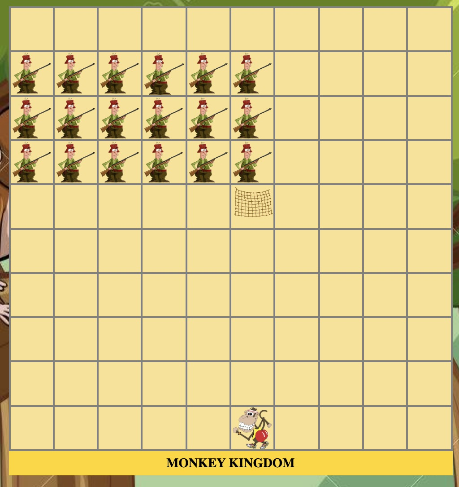
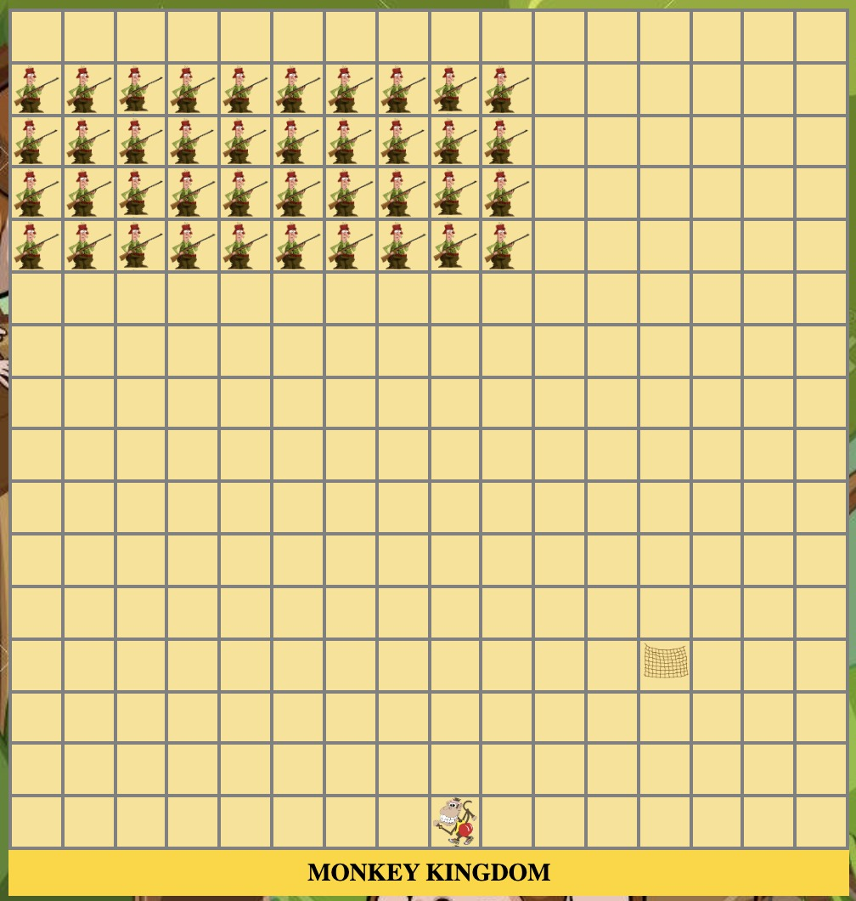
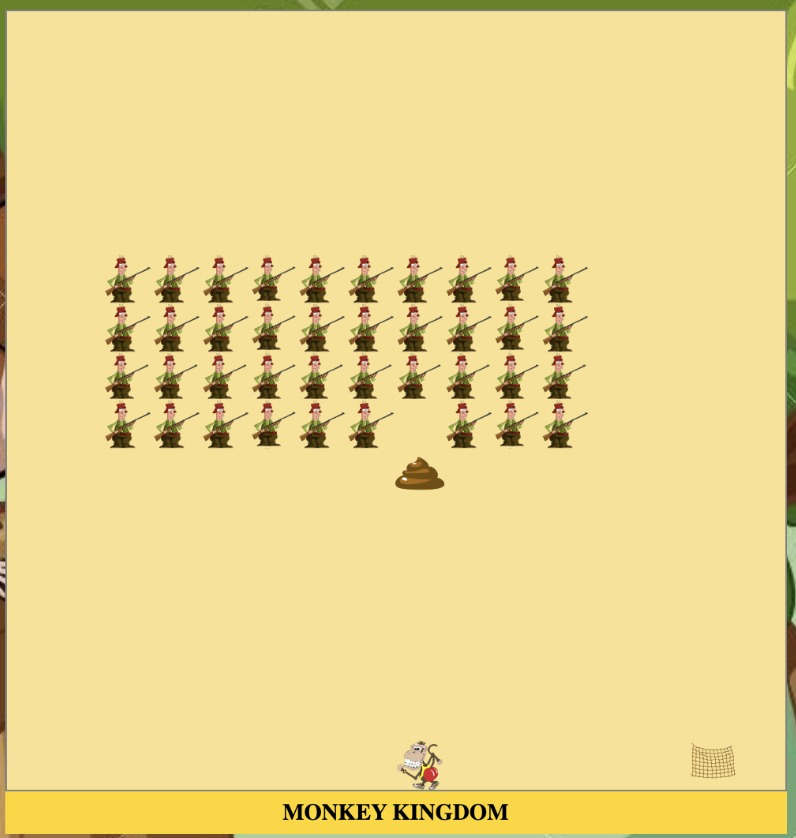

# Human Invaders 👨🐒


## Overview 


My task was to create a grid-based game rendered in the browser using HTML, CSS and JavaScript. I completed the project individually within one week during the Software Engineering Bootcamp at General Assembly ('GA'). 

GA gave us a selection of arcade games to choose from. I decided to take on _Space Invaders_. I came up with a light hearted and funny theme during the planning process. The user will control a Monkey 🐒 and the objective is to kill the humans who are on their way to invade the Monkey Kingdom by firing poop 💩at them.

The project was an opportunity to put together the knowledge I learnt on JavaScript and manipulating the DOM while recreating a classic game.


## Brief

- **Render a game in the browser**
- **Design logic for winning & visually display which player won**
- **Include separate HTML / CSS / JavaScript files**
- Stick with **KISS (Keep It Simple Stupid)** and **DRY (Don't Repeat Yourself)** principles
- Use **Javascript** for **DOM manipulation**
- **Deploy your game online**, where the rest of the world can access it
- Use **semantic markup** for HTML and CSS (adhere to best practices)

## The Technologies Used 
- HTML5
- CSS3
- JavaScript (ES6)
- Git and GitHub
- Google Fonts
- QuickTime Player and GarageBand


## The Approach 

### The Grid 

- The game is built using a grid. JavaScript is responsible for building a 10 x 10 grid for level 1 and 16 x 16 grid for level 2 by creating HTML divs using a for loop and appending the divs as children of the grid. 

  ``` js
  const width = getWidth()
  const gridCellCount = width * width
  const grid = document.querySelector('.grid')
  const cells = []
  let currentMonkey = monkeyStartPosition()
  let humans = getHumans()

    for (let i = 0; i < gridCellCount; i++) {
    const cell = document.createElement('div')
    if (levelCompleted === 1) {
      cell.classList.add('cellstyleforlevel2')
    } else {
      cell.classList.add('cellstyle')
    }
    if (i === currentMonkey) {
      cell.classList.add('monkeystyle')
    }
    grid.appendChild(cell)
    cells.push(cell)
  }
  ``` 


<br>

- The size of the grid varies depending on the level. Functions are used to determine the width for the given level to ensure the right grid is rendered. Other variables also change to increase the difficuly of the game.

  ``` js
  function getWidth() {
  if (levelCompleted === 1) {
    return 16
  } else {
    return 10
  }

  ``` 
<br>

- Snapshots of the grid for level 1 and 2 (it isn't visible during gameplay)

-  

- 

<br>

### Monkey movement 
- Moving the monkey comes from an event listener that checks for a keydown event on the user's keyboard:


  ``` js
  document.addEventListener('keydown', (event) => {
    if (event.key === 'ArrowRight') {
      if (currentMonkey === cells.length - 1) {
        return
      }
      currentMonkey += 1
    } else if (event.key === 'ArrowLeft') {
      if (currentMonkey === width * width - width) {
        return
      }
      currentMonkey -= 1
    }
    if (currentMonkey === currentNet) {
      lives -= 1
      noOfLives.innerHTML = `LIVES: ${lives}`
      playmonkeyScream()
      currentNet = null
      doesNetExist = false
      if (lives === 0) {
        playerLost()
      }
    }
    renderGame()
  })

  ``` 


### Starting Position of the Humans 
- Humans are defined as an array of numbers which corresponds to their position on the grid: 

  ``` js
  function getHumans() {
    if (levelCompleted === 1) {
      return [3, 4, 5, 6, 7, 8, 9, 10, 11, 12, 19, 20, 21, 22, 23, 24, 25, 26, 27, 28, 35, 36, 37, 38, 39, 40, 41, 42, 43, 44, 51, 52, 53, 54, 55, 56, 57, 58, 59, 60]
    } else {
    return [2, 3, 4, 5, 6, 7, 12, 13, 14, 15, 16, 17, 22, 23, 24, 25, 26, 27]
    }
  }
  ``` 

- They are then displayed on the grid using a for loop to add the 'humanstyle' class (with CSS styling).
 
  ``` js
    for (let i = 0; i < humans.length; i++) {
      cells[humans[i]].classList.add('humanstyle')
    }
  ``` 

<br>

### Humans Movement: humanMovingInterval
- This interval is responsible for updating the humans array. Humans move every 1000 milliseconds in level 1 and 500 milliseconds in level 2.

- I wrote functions to determine whether there is one or more humans at the leftest or rightest column. This is important because if there is, the humans have to move down a row. The modulo operator was particularly handy for this.

   ``` js
    function isAnyHumanAtRightestColumn() {
      return humans.some((elem) => {
        return elem % width === width - 1 
      })
    }

    function isAnyHumanAtLeftestColumn() {
      return humans.some((elem) => {
        return elem % width === 0
      })
    }

  ``` 
<br> 

- Using the functions above as conditions, I wrote if statements to decide how and when to update the humans array to reflect the cell positions they will next be at. I also utilised variables to decide whether the humans should move left or right after moving down. Here is a snippet:

  ``` js
  if (isAnyHumanAtRightestColumn()) {
      if (hasJustCollided === true) {
        isGoingLeft = true
        humans = UpdateHumanGoOneCellLeft()
        hasJustCollided = false
      } else {
        humans = UpdateHumanGoOneRowDown()
        hasJustCollided = true
        if (humanReachedLastRow()) { 
          playerLost()
        }
      }
  ``` 


### Humans Shooting Net: netDroppingInterval 

- This interval is responsible for updating the variable currentNet. The value of currentNet corresponds to the net's position on the grid. 

- These are the functions to determine whether the net collided with Monkey or if the net reached the bottom row. These are the scenarios where the net has to be removed from the grid.
  ``` js
    function didNetCollidewithMonkey() {
      return currentNet === currentMonkey
    }

    function isNetAtBottomRow() {
      return currentNet >= width * width - width 
    }
  ``` 

<br> 

- Relying on the functions above, I wrote if statements to decide how to update the variable currentNet and to check collision. I only wanted one net to exist at a time hence I utilised a doesNetExist variable to check whether a net already existed on the grid. Here is a snippet:

  ``` js

  if (doesNetExist) {
      if (didNetCollidewithMonkey()) {
        currentNet = null
        doesNetExist = false
        playmonkeyScream()
        lives -= 1
        noOfLives.innerHTML = `LIVES: ${lives}`
        if (lives === 0) {
          playerLost()
        }
   ``` 

 <br>

- I had initially decided to have a random (alive) human to drop the net but it didn't seem to make sense if there was a human underneath the human dropping the net. Then I decided to potentially filter for an array of 'eligible humans' to drop net by checking whether there are any humans one or two rows below the eligible human. However, this seem to mean that the humans won't be able to drop net when it is close to the bottom row. Thus I made a gameplay decision for the last human to drop the net: 

  ``` js

    } else {
      currentNet = humans[humans.length - 1] + width
      doesNetExist = true
    }
   ``` 

<br>

- When there is a collision between monkey and net, the game plays a short monkey screaming audio!

<br>

### Monkey Shooting Poop: PoopShootingInterval

- This interval is responsible for updating the variable poop. The value of poop corresponds to the poop's position on the grid.  

- The user shoots a poop by clicking spacebar. Hence this interval is within an event listener. 


- 


### renderGame() 
- Monkey movement, humanMovingInterval, NetDroppingInterval and PoopShootingInterval are responsible for updating the variables, hence the state of my game. 

- The renderGame function is responsible for displaying the updated variables to the DOM. It is called at the end of all sections that updates the variables: 

  ``` js
  function renderGame() {
    /// section to render updated Monkey position
    cells.forEach(cell => { 
      cell.classList.remove('monkeystyle')
    })
    cells[currentMonkey].classList.add('monkeystyle') 
    ///section to render updated humans
    cells.forEach(cell => {
      cell.classList.remove('humanstyle')
    })
    for (let i = 0; i < humans.length; i++) {
      cells[humans[i]].classList.add('humanstyle')
    }
    /// section to render net dropping 
    cells.forEach(cell => {
      cell.classList.remove('net')
    })
    if (currentNet) {
      cells[currentNet].classList.add('net')
    }
    /// section to render poop
    cells.forEach(cell => {
      cell.classList.remove('poop')
    })
    if (poop) {
      cells[poop].classList.add('poop')
    }
  }
   ``` 

- Time spent on refactoring was very useful as separating the state and the rendering of the game state has given my code the structure it needed! 


### Local Storage 
- I utilised localStorage to keep track of the uers's progress. 

- When a user succesfully completes level 1, a data item 'levelcompleted' with the value 1 is stored inside localStorage and the variable levelCompleted's value would be reassigned.

  ``` js
  function playerWon() {
    if (localStorage) {
      localStorage.setItem('levelcompleted', 1)
  }

  let levelCompleted = 0
  if (localStorage) {
  levelCompleted = Number(localStorage.getItem('levelcompleted'))
  }

  ``` 

- This brings in the level 2 modifications. For example the speed at which the humans are moving will increase to make the game more difficult:

  ``` js
  function getHumanSpeed() {
    if (levelCompleted === 1) {
      return 500
    } else {
      return 1000
    }
  }
  ``` 

### Challenges 
- I was very eager to get going at the beginning and overlooked the importance of detailed planning especially on the logic. I had to write the human movement logic over and over again before I got it right!

- Before I refactored my code I found it challenging to debug because the code was not organised 

- There were unique issues that I had not thought about regarding collision. Take net colliding with monkey as an example. At the beginning, I had only taken into account the net colliding into the monkey but not the other way around. As a result of this sometimes the Monkey would not lose a life if he briefly runs into the net. I solved the issue by also checking for net collision whenever user moves Monkey.


### Victories 
- I had my minimal viable product earlier than planned and decided to refactor my code, This was more difficult than expected but it was one of the biggest learning curve in this project. It gave me the opportunity to rethink and refine the logic of my game. More importantly, it taught me to separate the game state, setIntervals, functions and the rendering of the game. As a result of this, I have code that is shorter, cleaner and much more scalable and easier to understand. 

- Having two levels. I was glad that not only did I manage to render a bigger grid with humans, I also managed to increasae the difficulty by changing things such as increasing the speed at which the nets were dropping. 


### Potential future features 
- More levels and features. For example the humans could occasionally throw a banana. If the user succesfully clicks on it, an extra life would be rewarded. 


### Lessons learned